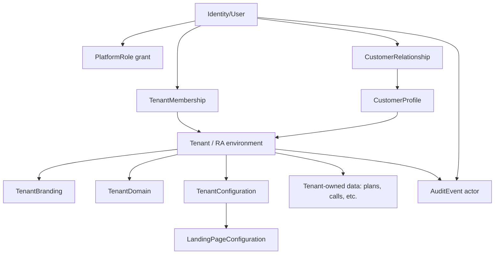

# Identity, tenancy, and tenant provisioning

**Status:** TASK-002 architecture baseline, corrected for the B2B2C product model. This is design documentation only; it does not add authentication, a schema, or provisioning features.

## Product and terminology

The product is a **B2B2C SaaS for Research Analysts (RAs)**. The platform sells software to an RA; each RA operates a private, tenant-branded environment for its own customers. It is not an RA marketplace: customers do not browse, compare, choose, or switch RAs through the platform.

| Term | Meaning |
| --- | --- |
| **Identity** | A globally unique authenticated human account; separate from business profiles and tenant roles. |
| **Tenant** | One RA or RA organization; the ownership and data-isolation boundary. Both sole analysts and organizations fit this abstraction. |
| **Tenant membership** | An identity's active relationship to a tenant, with a tenant-local role and lifecycle state. |
| **Customer profile/relationship** | Tenant-owned customer data plus the explicit relationship permitting an identity to act for that customer in that tenant. |
| **Platform role** | A separately granted internal platform role, such as `PLATFORM_ADMIN`. |
| **Tenant configuration** | Controlled tenant-specific branding, entry-point, feature, and landing-template settings consumed by shared application code. |

## Identity, tenant, and customer model

Use one global **Identity/User** per human. It has an opaque ID, verified login identifier(s), verification state, account status, and session/security state. Identity is never itself proof of access to a tenant resource.

One identity may hold multiple tenant memberships and, technically, multiple tenant-specific customer relationships. This supports legitimate future overlap but the initial product is **tenant-context-first**: a customer enters a specific RA's branded environment, signs in/activates there, and sees only that RA's onboarding, services, subscriptions, dashboard, and entitled content. The UX must not promote cross-RA participation or switching.

A customer is a global identity plus a tenant-specific `CustomerProfile` and `CustomerRelationship`/`CustomerMembership`. Customer profiles, KYC/business data, subscriptions, calls, and private data remain tenant-scoped even if the human independently becomes a customer of another RA later.

Candidate lifecycle states, subject to TASK-003 validation:

| Subject | Candidate states | Meaning |
| --- | --- | --- |
| Identity | `PENDING`, `ACTIVE`, `SUSPENDED`, `DISABLED` | Verification and account-use eligibility. Disabled/suspended accounts cannot rely on old sessions. |
| Tenant | `PROVISIONING`, `PENDING_CONFIGURATION`, `ACTIVE`, `SUSPENDED`, `CLOSED` | Operational tenant lifecycle. Activation is a privileged operation, not mere row existence. |
| Membership/relationship | invited/pending, active, revoked/suspended | Access relationship lifecycle. |

Disabling an identity, suspending a tenant, revoking a relationship, revoking sessions, and deleting data are distinct operations. Suspension must restrict access without assuming deletion of historical records. Data retention and hard deletion require future legal/privacy decisions.

## Roles and platform separation

| Scope | Minimum role | Intended authority |
| --- | --- | --- |
| Platform | `PLATFORM_ADMIN` | Internal control-plane operations explicitly granted by platform policy. |
| Tenant | `ANALYST_OWNER` | Accountable initial owner of one RA tenant. |
| Customer relationship | `CUSTOMER` | Tenant-specific customer access only. |

Future roles may include `ANALYST_ADMIN`, `ANALYST_STAFF`, `SUPPORT`, and `COMPLIANCE_REVIEWER`; each needs a concrete permission set before use. Tenant membership cannot create or escalate `PLATFORM_ADMIN`. A platform role is not blanket permission to view/export/mutate sensitive tenant or customer data. Privileged support must be explicit, least-privilege, purpose-scoped, time-bounded where possible, and auditable.

## Control-plane provisioning and one-codebase invariant

The internal Platform Admin is the future operational control plane for a tenant lifecycle. A future authorized workflow may: create an RA tenant; record analyst/business information; create/invite a tenant owner; configure branding, an entry point/domain, a landing template, enabled features, services/plans/integrations when applicable; approve existing-customer onboarding; review; and activate or suspend the tenant. Every material lifecycle and privileged-support operation needs authorization and auditability.

> Onboarding RA #2, #50, or #500 must never require copying the application, coding a new dashboard, manually creating RA-specific source routes, or deploying another codebase.

The RA dashboard is built once: **shared dashboard code + authenticated identity + authorized tenant context + tenant configuration + tenant data = RA-specific experience**. Normal customization must not use tenant-name source branches such as `if tenant == "ABC Research"`.

## Tenant-branded entry points and landing pages

New customers may arrive through an RA's tenant-branded entry point. The future landing-page architecture is **shared templates/components + tenant branding + controlled landing configuration + tenant services/plans**. It is not an arbitrary page builder or tenant-authored executable code.

Candidate controlled configuration includes business/analyst name, logo, palette, approved theme/typography, analyst image, hero/about content, service sections, testimonials, FAQ, contact data, and required disclosures. Content/workflows must later be reviewed for security and compliance needs.

Trusted tenant resolution should eventually use a unique slug at a platform subdomain (for example, `tenant-slug.platform-domain.example`) and later optionally a verified custom domain. Hostname/domain mapping establishes candidate tenant context; it never authorizes private access. Future implementation must validate mappings, enforce unique slugs/domains, verify custom-domain ownership, prevent host-header spoofing, handle inactive/suspended tenants safely, and partition caches by tenant/audience.

## Existing and new customer onboarding

An RA may join with an established customer base. Future architecture must support controlled existing-customer onboarding rather than assuming public self-registration: individual invitation, approved manual onboarding, approved bulk import, activation links, and customer account claiming/verification are candidates. No mechanism is selected or implemented here.

Expected conceptual flow: RA joins → platform provisions/configures tenant → approved existing customers are invited/imported → account activation → tenant-specific relationship → required verification/KYC → tenant services/subscriptions associated. New customers may instead originate from the RA's branded landing page.

## Research-call distribution boundary

Future flow: an RA A user creates a call; the server validates Tenant A and permission; the call is owned by Tenant A; eligibility is calculated from Tenant A services/subscriptions; only eligible Tenant A customers receive or access it. Future channels may include dashboard and WhatsApp. Tenant A calls must never be distributed to Tenant B customers.

## Conceptual TASK-003 relationships

This is not a Prisma schema or constraint commitment.

Candidate concepts for TASK-003: `Identity/User`, `PlatformRole`, `Tenant`, `TenantMembership`, `CustomerProfile`, `CustomerRelationship`/`CustomerMembership`, `TenantBranding`, `TenantDomain`, `TenantConfiguration`, `LandingPageConfiguration`, and `AuditEvent`. TASK-003 must select the minimum first schema and validate identifiers, constraints, lifecycle transitions, and ownership; do not create a giant future-module schema.

## Unresolved human decisions

1. Sole-analyst versus legal-organization provisioning, verification, ownership transfer, and activation approval.
2. Customer invitation/manual/bulk import, account claiming, consent, verification, duplicate identity, and recovery rules.
3. Approved branding/template/content boundaries and review/disclosure workflow.
4. Custom-domain verification, DNS/TLS ownership, routing, and suspended-domain behavior.
5. Support/compliance access purposes, approvals, scope, expiry, and audit retention.
6. Legal/privacy, KYC, audit, retention, export, and deletion requirements.
